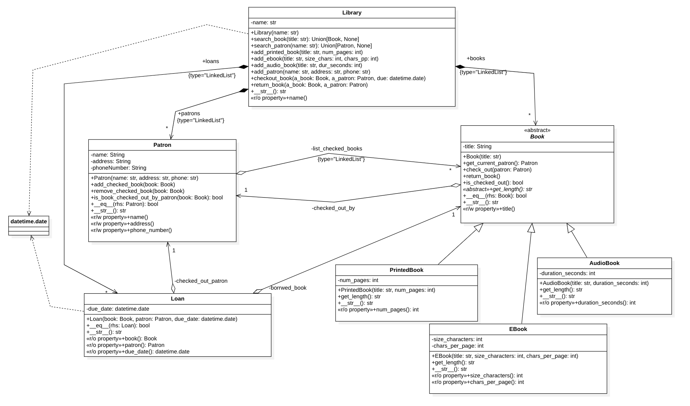

# Programming Assignment 2: Library Management

## Before You Begin
- **Read this document carefully**. 
- Double check the timeline for this PA.
- We expect a comprehensive use of exception handling and user input validation.

## Administrative Policy
### AI Policy
- You should **not** use AI tools at any task related to this PA. 
- This includes Chat models (like GPT, Claude, Gemini, etc.), VSCode Copilot (and similar).

### Contributions
- This PA is to be completed individually without help (other than from the instructional team). 
- Sharing solutions or discussing implementation details with others is not allowed. 
- This PA has the same standing as in a rigorous as an Exam. 
- We expect to see progress on the development of the code on the student's git repository. 
- You can use:
    - your notes
    - the course materials (from the [website](https://duke.is/p4ml))
    - the course textbooks

### Learning Objective:
- The learning objectives of this assessment is to assess the student's 
    - understanding and use of black-box/white-box testing.
    - mastery of abstractions and Object-Oriented Programming
    - mastery on data structures (design, use, and implementation)
- Expecting the following learning outcomes:
    1. Read and write code in Python,
    1. Analyze a problem and create a computer program to solve it,
    1. Use top-down design and abstraction to write clean, readable, fixable code


### TIMELINE
1. You received this Programming Assignment on *Sunday 11-16-2025*. 
1. **Pre-grader Phase** --- *Validating your Tests*
    - Starts on _Wednesday 11-19-2025_.
    - Use ADTG to run **your test cases** against your solution and our solution in the platform.
    - The more test cases you write, the more thoroughly your will validating your implementation and your understanding. 
    - Use BVA for defining your cases. 
        - One of the goals of this assessment is to _assess how comprehensive your testing is_. 
        - By running your tests again our solution, you have the tools to identify question points, issues on your program, and fix it. _USE IT!_
        - Write your tests using **black-box strategy**.
    - If you have questions about your test cases, ask for help to TAs.
1. **Grader Phase**
    - ADTG will use **our** test cases to grade your code.
    - This will happen only once, right after the deadline and will be scheduled by your instructors. 
    - **You will not be able to receive a grade before the assessment deadline**
    - No changes are allowed after the deadline. 
1. Submission is due the day indicated in ADTG Portal.


### Main Program and Tests
You must implement your main library program in `main.py`.
We will not test this automatically, but during the code review. 

- You will test your program using `pytest`.
- Include, for each class in your solution, a file called `tests_<class>.py` all lower case.
    - E.g., for `Library.py` use `tests_library.py`
- We will run your Pytest cases from those files. 


### Submission:
- You will submit _one `.py` file per class_ and _one test file for each class_. 
- Your main program should be implemented in `main.py`. 
    - We'll review this during Code Review
- *No other files will be uploaded to the grader*.

### Rubric:
- **Automatic Testing** counts for $70\%$ of the assignment. 
    - your test cases should cover $95\%$ of your branch coverage 
- **Code Review** counts for $30\%$ of the assignment. 
    - This includes (but not limited to):
        - correct use of data structures, control statements, variable names, use of comments, and programming style. 
        - correct use of abstraction (encapsulating, inheritance, polymorphism)
        - appropriate comments
        - correct use of type hints
        - correct use of exception handling in both your classes and your main program
        - Does the solution leverage inheritance and polymorphism appropriately?


### Import Restrictions
- **Only libraries discussed in class can be used**. 
- You **must to implement your own data structures**, e.g., `LinkedList`. 
    - Do not use Python `list`. _By using it, you will forfeit all 30% of the code review score._
- You cannot import any package outside those discussed in class
    - That list includes: `pytest`, `json`, `pandas`, `numpy`, `re`, `string`, `datetime`. 
    - If you need another package, please reach out to your instructor at _least a week before the deadline_.


## Hints
- We recommend to create all required files (see next section).
- Define all classes, and all their methods as stubs. 
    - A _stub_ is an empty method, that will have a correct full declaration with all arguments, but it's body will be just `pass`.
- Commit and Grade. 
- Review carefully the output. Especially regarding imports. 
- Implement one class at a time. Push and Grade. Then move on. 
    - We recommend this implementation order: Book, PrintedBook, EBook, AudioBook, Link, LinkedList, Patron, Loan.
        - For each class implement all test to cover 100% branch. (except Book, that as it's abstract you won't get 100, but close enough.)
    - Then implement Library, but implement one method at a time. As Add depends on search, would start with search. 


---
---
---

## Problem Statement

### Description
You will implement an application to handle a library's operations, including adding patrons, adding books, searching them out and the checking books.
Checking books operations include checking out a book, retrieving the checked-out status of a book, returning a book, adding a checked-out book to a patron, removing a checked-out book from a patron, and retrieving the checked-out status of a book by a patron. 
The following UML class diagram depicts the classes you will use to implement your application; the main program is not depicted. 
We will use the interface provided there to test your program.

---

### Library Program
This program will display a menu providing the library's users with several functions. 
Your application will display the following menu on the terminal console:

```
--------------------------------- 
            Main Menu 
--------------------------------- 
1) Add Patron  
2) Add Book 
3) Search for Patron 
4) Search for Book
5) Check Out Book 
6) Return Book
                         99) EXIT 
--------------------------------- 
```

As the program starts, it should instantiate the `Library` class. 
This object will represent the library, and all the calls to implement options 1 through 6 should call methods from this object.  

- **Option (1):** the program asks the user for the patron’s name, address, and phone number and calls the library `add_patron` method.  
- **Option (2):** will present a sub-menu to allow the user to add a printed book, an Ebook, or an Audiobook. 
For each one, the program asks the user for the book's title and the relevant information. 
Then, it calls the library's `add_printed_book`, `add_ebook`, or `add_Audio_book` method.
    ```
    --------------------------------- 
                Add Book Menu 
    --------------------------------- 
    A) Add Printed Book
    B) Add Ebook
    C) Add Audiobook
    --------------------------------- 
    ```
- **Option (3):** the program asks for a patron’s name and calls the `search_patron` method from the library. 
If a patron matches the name (exact match), it will print all the patron’s information to the console.  
- **Option (4):** the program asks for a book’s title and calls the `search_book` method from the library. 
If a book matches the title (exact match), it will print the book’s title and the number of pages to the console. 
- **Option (5):** the program asks for a book’s title, a patron’s name, and the date the book will be due (format year month day). 
Then, search for the book and patron (see options 3 and 4) and calls the `check_out_book` method to complete the loan if both patron and book were found.  
- **Option (6):** similarly, searches for book and patron and calls the `return_book` method from the library object.
- **Option (99):** asks the user for confirmation and terminates the program.  

If the user inputs an Invalid Option, you should display the phrase: `Invalid choice. Please try again.` and end the line before asking for another input from the user.
The program should keep running until the user selects to terminate the program.  


---

### Library Package --- Class Descriptions
__*Getters and setter are not shown in this list but shown as properties (either read only or read/write) in the UML Diagram.*__

#### Class `Library`
##### Member Variables
- `name: string` : Represents the name of the library
- `patrons: LinkedList()` : stores a list of all the patrons in the library
- `books: LinkedList()` : stores all the books present in the library, which may belong to different concrete classes
- `loans: LinkedList()` :  stores all the loaned books and the patron who loaned it

##### Member Functions
- Constructor (initializer): initialize the object correctly.
- `search_book`: searches the books list for a book that matches the title. Returns the object or `None` (no exception). 
- `search_patron`: searches the patrons list for a patron that matches the name. Returns the object or `None` (no exception). 
- `add_printed_book`: when a book with the given _title_ does not exist already (uses `search_book`), it creates a new `PrintedBook` and adds it to the printed books list. 
If the book exists, _do nothing_.
- `add_ebook`: when a book with the given _title_ does not exist already (uses `search_book`), it creates a new `EBook` and adds it to the printed books list. 
If the book exists, _do nothing_.
- `add_audio_book`: when a book with the given _title_ does not exist already (uses `search_book`), it creates a new `AudioBook` and adds it to the books list. 
If the book exists, _do nothing_.
- `add_patron`: when a patron with the given _name_ does not exist already (uses `search_patron`), it creates a new `Patron` and adds it to the patrons list. 
If the patron exists, _do nothing_.
- `check_out_book`: takes a book, a patron and a date’s data (checks object pointers are not null). 
If the book is not checked out, create a `Loan` object for that book, patron, and date, and add it to the `loans` list. 
Adds the book to the patrons (`add_checked_book`) and the patron to the book (`check_out`) 
- `return_book`: takes a book and a patron (checks not null). 
Searches for the loan that has that book and patron. 
When found, remove the book from the patron object and remove the patron from the book object. 
Finally, remove the `Loan` pointer from the `loans` list.

#### Class `Book`
Book is an abstract class. 

##### Member Variables
`title: string` : The title of the book
`checked_out_by: Patron` : If not `None`, the patron that currently has the book.

##### Member Functions
- Constructor (initializer): initialize the object correctly.  
- `check_out`: sets the `checked_out_by` attribute to the given patron.  
- `is_checked_out`: returns true when `checked_out_by` is not `None`. 
- `return_book`: removes the book from the patron's checkout list, and sets the `checked_out_by` attribute to `None`.
- `get_current_patron`:  return `checked_out_by`
- `get_length`: abstract method. 
- Equality is based on the book's title.

#### Class `PrintedBook` 
It's a subclass o `Book`

##### Member Variables
- `num_pages : int` : The number of pages the book contains.

##### Member Functions
- Constructor (initializer): initialize the object correctly.  
- `get_length`: 
    - returns `<pages> pages`, where `<pages>` is the number of pages of the book.

#### Class `EBook` 
It's a subclass o `Book`
##### Member Variables
- `size_characters : int` : The number of characters in the book.
- `chars_per_page : int` : The number of characters that fit in a page.

##### Member Functions
- Constructor (initializer): initialize the object correctly.  
- `get_length`: 
    - returns `"size <size>, <chars> c/p`, where `<size>` is the size of characters and `<chars>` is the number of characters per page of the book.

#### Class `AudioBook` 
It's a subclass o `Book`
##### Member Variables
- `duration_seconds : int` : The duration of an audiobook in seconds.

##### Member Functions
- Constructor (initializer): initialize the object correctly.  
- `get_length`: 
    - returns `<duration> sec` where `<duration>` is the duration in seconds (with thousand delimiter).

#### Class `Patron`
##### Member Variables
- `name : string` : The name of the patron
- `address : string` : The address of the patron
- `phone_number: string` : The phone number of the patron
- `list_checked_books` : The books the patron has checked out. Should be consistent with book->checked_out_by.

##### Member Functions
- Constructor (initializer): initialize the object correctly.
- `add_checked_book`: adds the book reference to the checked books list.  
- `remove_checked_book`: searches for a reference in the checked books list to match the given object. When found, the reference is removed from the list. 
- `is_book_checked_out_by_patron`: searches for a reference in the checked books list to match the given book object. Returns true when found; false otherwise. 
- Equality is based on the patron's name.

#### Class `Loan`
##### Member Variables
- `due_date: datetime.date`: the due date of the loan
- `checked_out_patron: Patron`: the patron who checked out the book.
- `borrowed_book: Book`: the book that has been checked out. 

##### Member Functions
- Constructor (initializer): initialize the object correctly.
- Equality is based on the book, patron and due date.

#### Class `LinkedList`
- Implemented in `LinkedList.py` and `Link.py`
- Based on Cannings book Implementation. 
- Although the class and file must be called `LinkedList`, you can implement your own variation (e.g., double-ended, doubly-linked, ordered-linked-list, circular)
- You can also opt to implement iterators for lists (as described in the textbook.)
- You should fully test your linked list, though we will not automatically test it but during code review.

#### Class `date`
This class represents Python's `datetime.date` objects. 
[Read the manual](https://docs.python.org/3/library/datetime.html#date-objects)

### Displaying Objects
All classes should implement the `__str__` method. 
Subclasses should call their parent's first, then add to it. 

Use the following to represent what you'll display:
- **Book**: 
    - `Book: "<title>".`
    - e.g., `Book: "Harry Potter and the Goblet of Fire".`  _(note that this is abstract, so this demonstrates the output for any particular subtype)_.
- **Printed Book**: 
    - `<book str> Printed <length>.`
    - e.g., `Book: "Harry Potter and the Goblet of Fire". Printed 520 pages.`
- **EBook**:  
    - `<book str> Ebook (<length>).`
    - e.g., `Book: "Harry Potter and the Goblet of Fire". Ebook (size 2, 200 c/p).` Reads: size 2, 200 characters per page.
- **Audio Book**:
    - `<book str> Audio - Duration: <length>.`
    - e.g., `Book: "Harry Potter and the Goblet of Fire". Audio - Duration: 32,000 sec.`
- **Patron**:
    - `Patron: <name>, <address> (phone). <quantity_books_checked_out> books checked out.`
    - e.g., `Patron: Jane Smith, 100 Science Dr. (555-666-5151). 1 books checked out.` (assuming there is 1 book in the checked out books).
- **Loan**: 
    - `Loan of <the book str> to <the patron str> Due on: MM-DD-YYYY.`. If the due date is not set, then instead of the date just add the string `"Not Set"`
    - e.g., `Loan of Book: "Harry Potter and the Goblet of Fire". Audio - Duration: 32,000 sec. to Patron: Jane Smith, 100 Science Dr. (555-666-5151). 1 books checked out. Due on: 01-22-2026.`
- **Library**: 
```
Library <name>:
\t- Books:
\t\t- <the list of books content - one per line>
\t- Patrons:
\t\t- <the list of patrons content - one per line>
\t- Loans:
\t\t- <the list of loans content - one per line>
``` 

- Example:
```
Library Durham Library:
    - Books:
        - Book: "Harry Potter and the Goblet of Fire". Printed 520 pages.
        - Book: "Harry Potter and the Goblet of Fire". Ebook (size 2, 200 c/p).
        - Book: "Harry Potter and the Goblet of Fire". Audio - Duration: 32,000 sec.
    - Patrons:
        - Patron: Jane Smith, 100 Science Dr. (555-666-5151). 1 books checked out.
        - Patron: John Smith, 100 Science Dr. (555-666-5160). 0 books checked out.
    - Loans:
        - Loan of Book: "Harry Potter and the Goblet of Fire". Audio - Duration: 32,000 sec. to Patron: Jane Smith, 100 Science Dr. (555-666-5151). 1 books checked out. Due on: 01-22-2026.
```

### Members Visibility
- Private attributes should be named as described in the class but prefixed with two underscores. 
    - E.g., for `name` should be `__name`.
- You can add other private methods to the class if that helps implementing your class functionally. 
    - These private methods should be prefixed by one underscore. 
    - Your Main Library program should **not** use them. 


### UML Diagram

